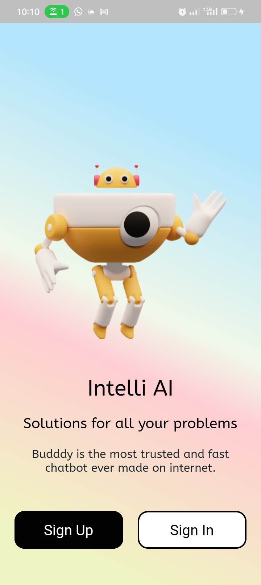
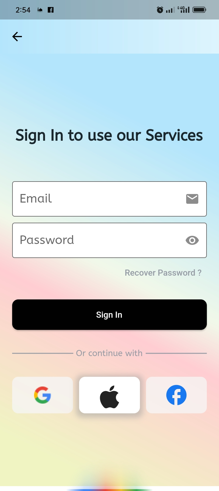
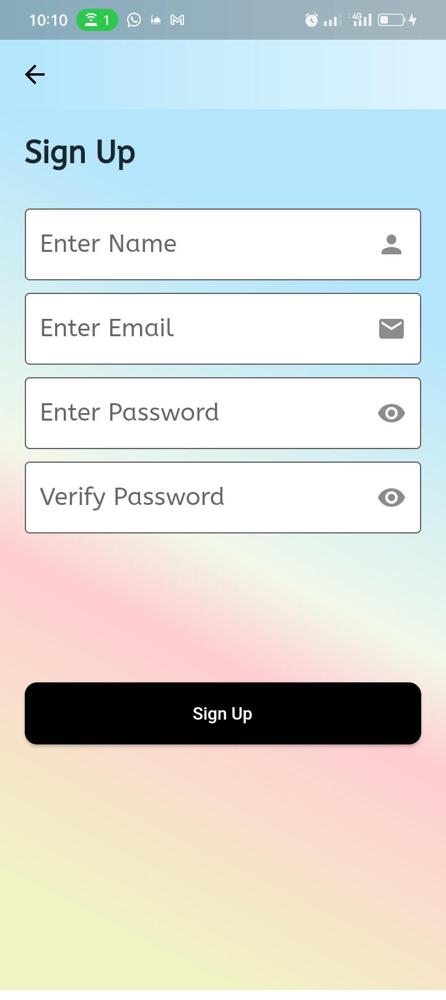
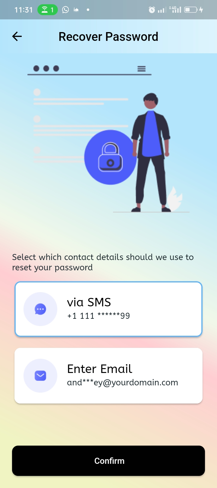
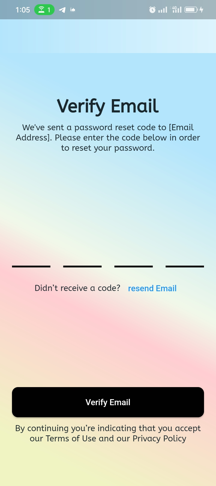
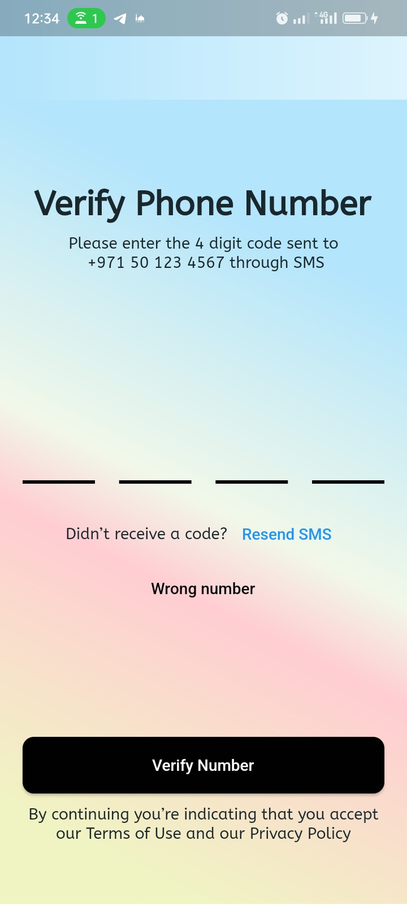

# Intell AI Chat Bot UI

Intell AI Chat Bot is a versatile Android and iOS chatbot designed to leverage the power of artificial intelligence in assisting users with resolving complex issues across different domains.

## Overview

This Git repository contains a some of the UI collection that I created using Flutter and Dart.

## Screenshots
<table>
  <tr>
    <td><p align="center">Landing Screen</p></td>
    <td><p align="center">Login Screen</p></td>
    <td><p align="center">SignUp Screen</p></td>
  </tr>
  <tr>
    <td valign="top"></td>
    <td valign="top"> </td> 
    <td valign="top"> </td>    
  </tr>
    <tr>
    <td><p align="center">Password Recovery Screen</p></td>
    <td><p align="center">Verify Email Screen</p></td>
    <td><p align="center">Verify Phone Screen</p></td>
  </tr>
  <tr>
    <td valign="top"></td>
    <td valign="top">   </td> 
    <td valign="top"> </td>    
  </tr>
  
 </table>


## Getting Started

To get started with Intell AI Chat Bot, follow these steps:

1. Clone the repository.
   ```bash
   https://github.com/mattias-nkonjo/Intelli-AI-Chat-Bot-Flutter-UI.git

## License
This project is licensed under the MIT License.

## Contact
Do you have a project or looking? we can get in touch [Mattias Nkonjo] at [mattiasthedev@gmail.com].

## Support me

- If you like the work please give me a star
